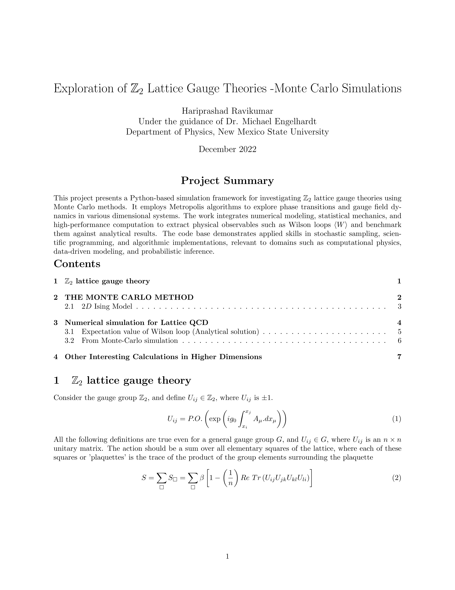
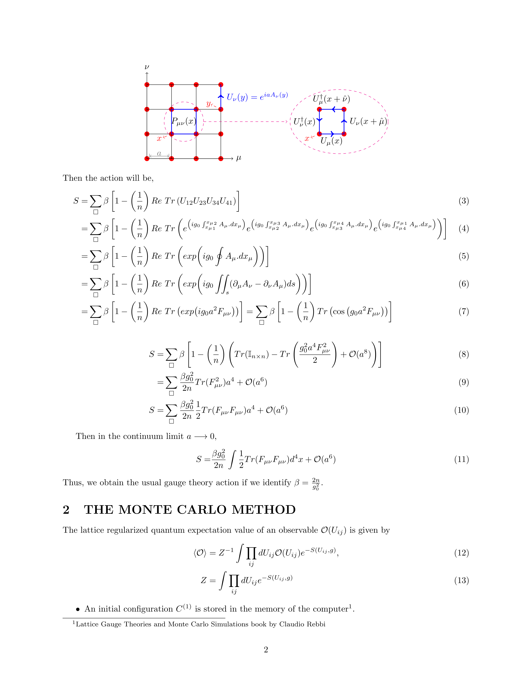
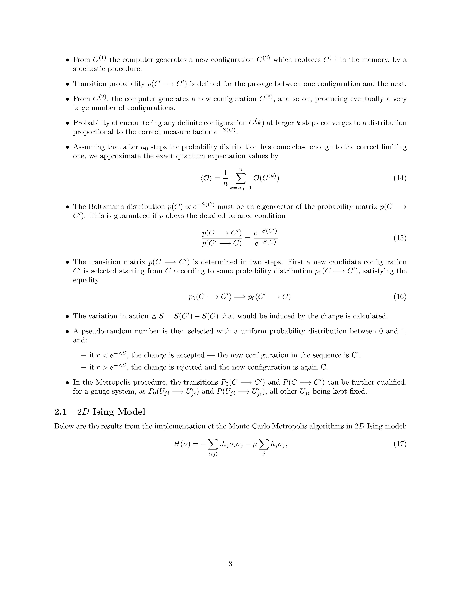
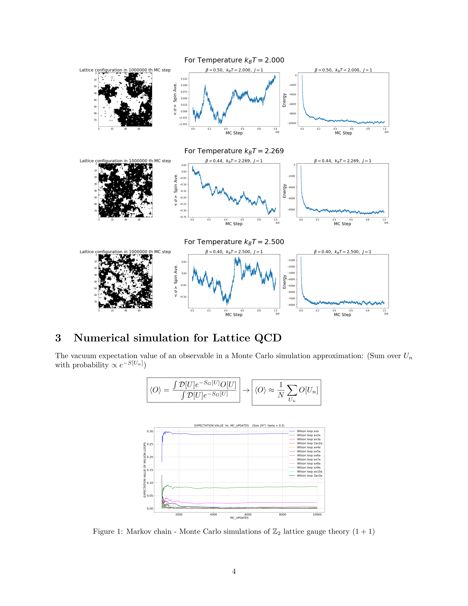
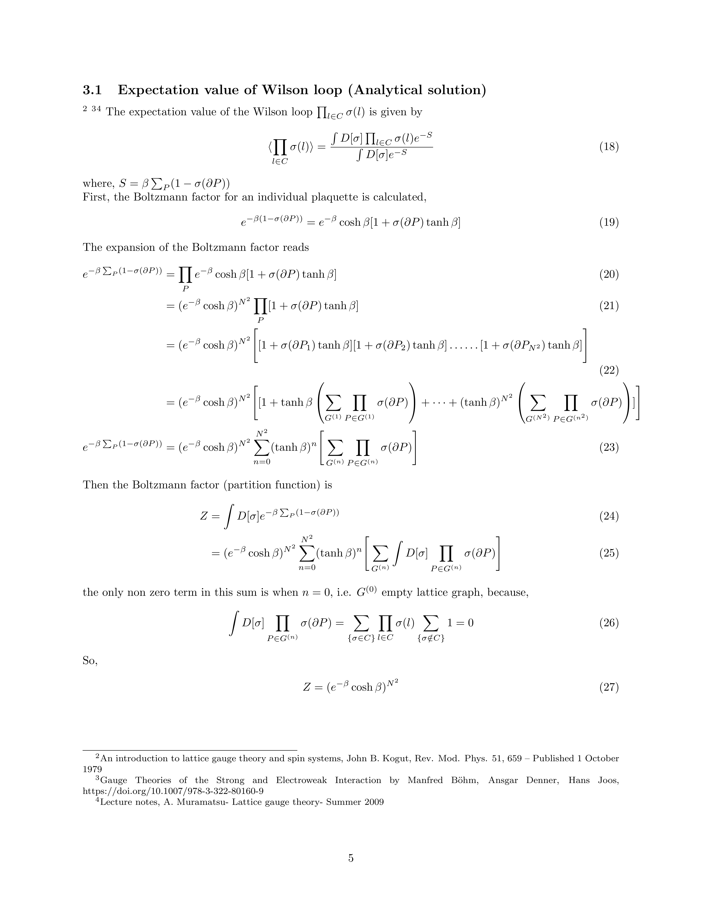
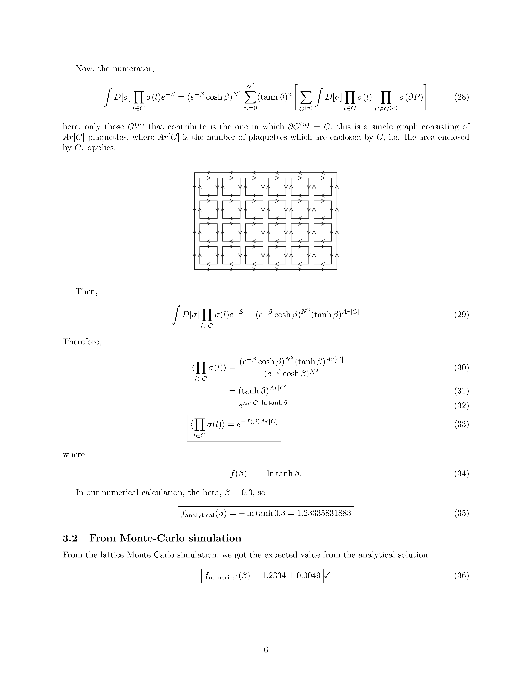
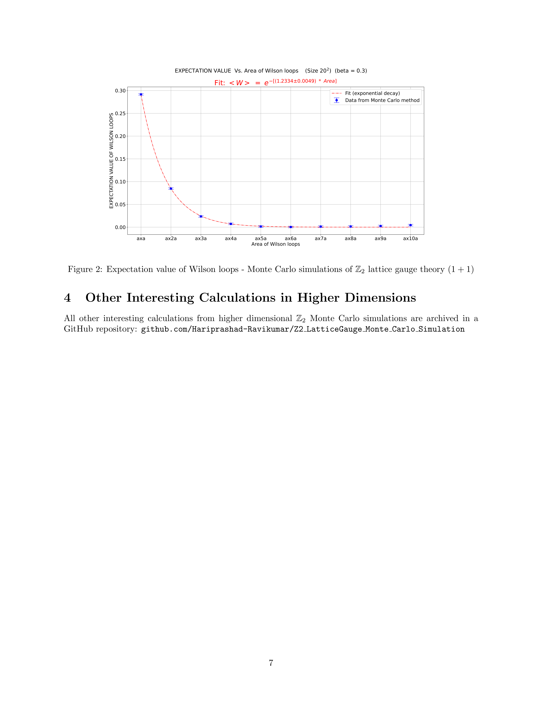

# $\mathbb{Z}_2$ Lattice Gauge Theory: Monte Carlo Simulations

This project develops a Python-based simulation framework for studying $\mathbb{Z}_2$ lattice gauge theories using Monte Carlo methods. It applies the Metropolis algorithm to explore phase transitions and gauge field dynamics across various dimensional lattice systems. Numerical modeling, statistical mechanics, and high-performance computation are combined to calculate physical observables like Wilson loops $\langle W \rangle$ and benchmark them against analytical results.

📄 **[Download the Full Project PDF](./README_Z2.pdf)**

## 📚 Project Report (Preview)

